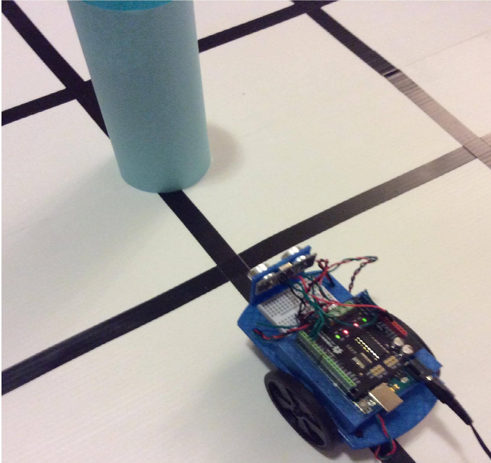

## Robot Maze Solver

**RoboNav** is the arduino program used to participate in the 2016 IEEE Robotics Competition. Copy the header and cpp files into the arduino library folder to use as API. The ino file runs the arduino program.

  

